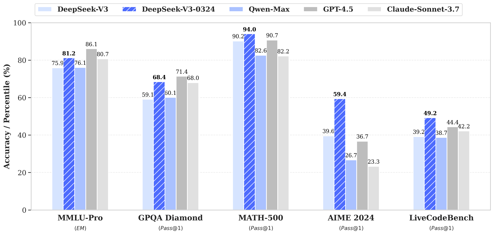

# DeepSeek-V3-0324
<!-- markdownlint-disable first-line-h1 -->
<!-- markdownlint-disable html -->
<!-- markdownlint-disable no-duplicate-header -->

<div align="center">
  
</div>
<hr>
<div align="center" style="line-height: 1;">
  <a href="https://www.deepseek.com/" target="_blank" style="margin: 2px;">
    
  </a>
  <a href="https://chat.deepseek.com/" target="_blank" style="margin: 2px;">
    
  </a>
  <a href="https://huggingface.co/deepseek-ai" target="_blank" style="margin: 2px;">
    
  </a>
</div>

<div align="center" style="line-height: 1;">
  <a href="https://discord.gg/Tc7c45Zzu5" target="_blank" style="margin: 2px;">
    
  </a>
  <a href="https://github.com/deepseek-ai/DeepSeek-V2/blob/main/figures/qr.jpeg?raw=true" target="_blank" style="margin: 2px;">
    
  </a>
  <a href="https://twitter.com/deepseek_ai" target="_blank" style="margin: 2px;">
    
  </a>
</div>

<div align="center" style="line-height: 1;">
  <a href="LICENSE" style="margin: 2px;">
    
  </a>
</div>

## Features

DeepSeek-V3-0324 demonstrates notable improvements over its predecessor, DeepSeek-V3, in several key aspects.



### Reasoning Capabilities

- Significant improvements in benchmark performance:
  - MMLU-Pro: 75.9 → 81.2 (+5.3)
  - GPQA: 59.1 → 68.4 (+9.3)
  - AIME: 39.6 → 59.4 (+19.8)
  - LiveCodeBench: 39.2 → 49.2 (+10.0)

### Front-End Web Development

- Improved the executability of the code
- More aesthetically pleasing web pages and game front-ends

### Chinese Writing Proficiency

- Enhanced style and content quality:
  - Aligned with the R1 writing style
  - Better quality in medium-to-long-form writing

- Feature Enhancements
  - Improved multi-turn interactive rewriting
  - Optimized translation quality and letter writing

### Chinese Search Capabilities

- Enhanced report analysis requests with more detailed outputs

### Function Calling Improvements

- Increased accuracy in Function Calling, fixing issues from previous V3 versions

---

## Usage Recommendations

### System Prompt

In the official DeepSeek web/app, we use the same system prompt with a specific date.

```
该助手为DeepSeek Chat，由深度求索公司创造。
今天是{current date}。
```

For example,

```
该助手为DeepSeek Chat，由深度求索公司创造。
今天是3月24日，星期一。
```

### Temperature

In our web and application environments, the temperature parameter $T_{model}$ is set to 0.3. Because many users use the default temperature 1.0 in API call, we have implemented an API temperature $T_{api}$ mapping mechanism that adjusts the input API temperature value of 1.0 to the most suitable model temperature setting of 0.3.

$$
T_{model} = T_{api} \times 0.3 \quad (0 \leq T_{api} \leq 1)
$$

$$
T_{model} = T_{api} - 0.7 \quad (1 < T_{api} \leq 2)
$$

Thus, if you call V3 via API, temperature 1.0 equals to the model temperature 0.3.

### Prompts for File Uploading and Web Search

For file uploading, please follow the template to create prompts, where {file_name}, {file_content} and {question} are arguments.

```
file_template = \
"""[file name]: {file_name}
[file content begin]
{file_content}
[file content end]
{question}"""
```

For Web Search, {search_results}, {cur_date}, and {question} are arguments.

For Chinese query, we use the prompt:

```
search_answer_zh_template = \
'''# 以下内容是基于用户发送的消息的搜索结果:
{search_results}
在我给你的搜索结果中，每个结果都是[webpage X begin]...[webpage X end]格式的，X代表每篇文章的数字索引。请在适当的情况下在句子末尾引用上下文。请按照引用编号[citation:X]的格式在答案中对应部分引用上下文。如果一句话源自多个上下文，请列出所有相关的引用编号，例如[citation:3][citation:5]，切记不要将引用集中在最后返回引用编号，而是在答案对应部分列出。
在回答时，请注意以下几点：
- 今天是{cur_date}。
- 并非搜索结果的所有内容都与用户的问题密切相关，你需要结合问题，对搜索结果进行甄别、筛选。
- 对于列举类的问题（如列举所有航班信息），尽量将答案控制在10个要点以内，并告诉用户可以查看搜索来源、获得完整信息。优先提供信息完整、最相关的列举项；如非必要，不要主动告诉用户搜索结果未提供的内容。
- 对于创作类的问题（如写论文），请务必在正文的段落中引用对应的参考编号，例如[citation:3][citation:5]，不能只在文章末尾引用。你需要解读并概括用户的题目要求，选择合适的格式，充分利用搜索结果并抽取重要信息，生成符合用户要求、极具思想深度、富有创造力与专业性的答案。你的创作篇幅需要尽可能延长，对于每一个要点的论述要推测用户的意图，给出尽可能多角度的回答要点，且务必信息量大、论述详尽。
- 如果回答很长，请尽量结构化、分段落总结。如果需要分点作答，尽量控制在5个点以内，并合并相关的内容。
- 对于客观类的问答，如果问题的答案非常简短，可以适当补充一到两句相关信息，以丰富内容。
- 你需要根据用户要求和回答内容选择合适、美观的回答格式，确保可读性强。
- 你的回答应该综合多个相关网页来回答，不能重复引用一个网页。
- 除非用户要求，否则你回答的语言需要和用户提问的语言保持一致。

# 用户消息为：
{question}'''
```

For English query, we use the prompt:

```
search_answer_en_template = \
'''# The following contents are the search results related to the user's message:
{search_results}
In the search results I provide to you, each result is formatted as [webpage X begin]...[webpage X end], where X represents the numerical index of each article. Please cite the context at the end of the relevant sentence when appropriate. Use the citation format [citation:X] in the corresponding part of your answer. If a sentence is derived from multiple contexts, list all relevant citation numbers, such as [citation:3][citation:5]. Be sure not to cluster all citations at the end; instead, include them in the corresponding parts of the answer.
When responding, please keep the following points in mind:
- Today is {cur_date}.
- Not all content in the search results is closely related to the user's question. You need to evaluate and filter the search results based on the question.
- For listing-type questions (e.g., listing all flight information), try to limit the answer to 10 key points and inform the user that they can refer to the search sources for complete information. Prioritize providing the most complete and relevant items in the list. Avoid mentioning content not provided in the search results unless necessary.
- For creative tasks (e.g., writing an essay), ensure that references are cited within the body of the text, such as [citation:3][citation:5], rather than only at the end of the text. You need to interpret and summarize the user's requirements, choose an appropriate format, fully utilize the search results, extract key information, and generate an answer that is insightful, creative, and professional. Extend the length of your response as much as possible, addressing each point in detail and from multiple perspectives, ensuring the content is rich and thorough.
- If the response is lengthy, structure it well and summarize it in paragraphs. If a point-by-point format is needed, try to limit it to 5 points and merge related content.
- For objective Q&A, if the answer is very brief, you may add one or two related sentences to enrich the content.
- Choose an appropriate and visually appealing format for your response based on the user's requirements and the content of the answer, ensuring strong readability.
- Your answer should synthesize information from multiple relevant webpages and avoid repeatedly citing the same webpage.
- Unless the user requests otherwise, your response should be in the same language as the user's question.

# The user's message is:
{question}'''
```

## How to Run Locally

The model structure of DeepSeek-V3-0324 is exactly the same as DeepSeek-V3. Please visit [DeepSeek-V3](https://github.com/deepseek-ai/DeepSeek-V3) repo for more information about running this model locally.

**This model supports features such as function calling, JSON output, and FIM completion. For instructions on how to construct prompts to use these features, please refer to [DeepSeek-V2.5](https://huggingface.co/deepseek-ai/DeepSeek-V2.5#function-calling) repo.**

**NOTE: Hugging Face's Transformers has not been directly supported yet.**

## License

This repository and the model weights are licensed under the [MIT License](LICENSE).

## Citation

```
@misc{deepseekai2024deepseekv3technicalreport,
      title={DeepSeek-V3 Technical Report}, 
      author={DeepSeek-AI},
      year={2024},
      eprint={2412.19437},
      archivePrefix={arXiv},
      primaryClass={cs.CL},
      url={https://arxiv.org/abs/2412.19437}, 
}
```

## Contact
If you have any questions, please raise an issue or contact us at [service@deepseek.com](service@deepseek.com).
